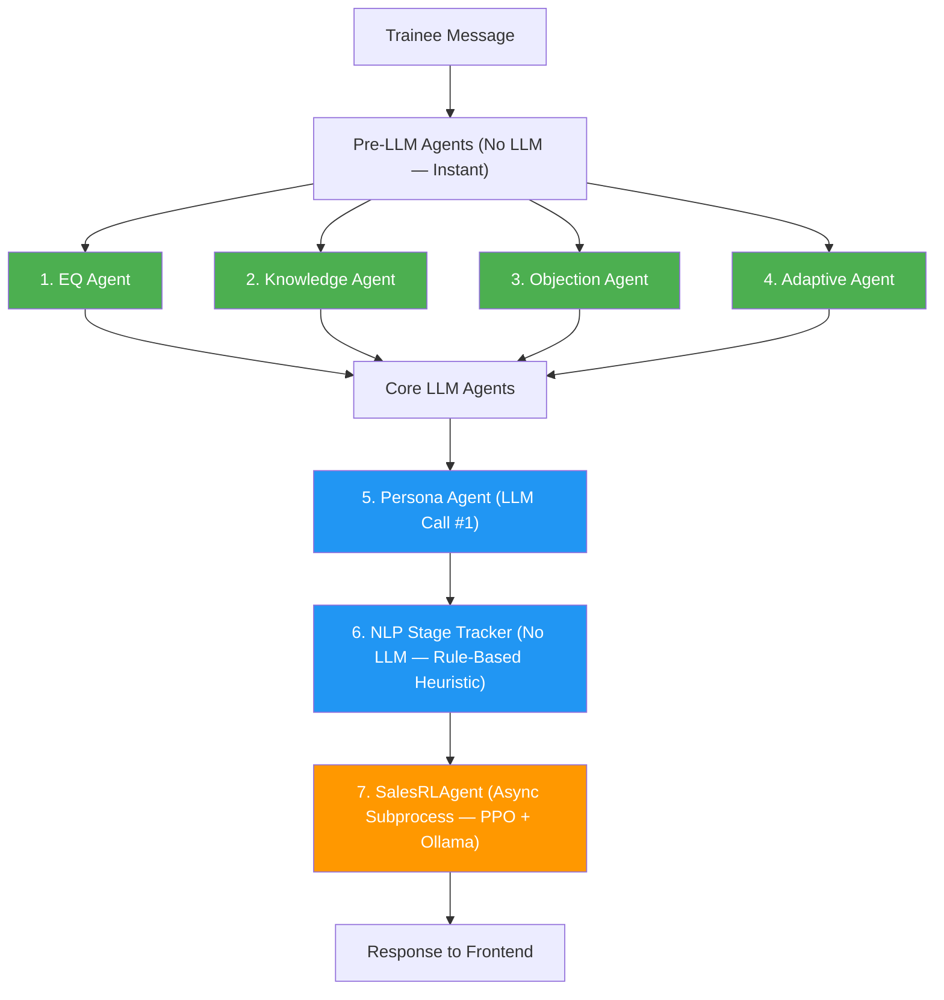

# Multi-Agent Roleplay System — Technical Report

**SalesForge AI · Final Year Project**
**Date:** March 2026

---

## Table of Contents

1. [System Overview](#1-system-overview)
2. [Architecture & Data Flow](#2-architecture--data-flow)
3. [Agent Details](#3-agent-details)
   - 3.1 EQ Agent
   - 3.2 Knowledge Accuracy Agent
   - 3.3 Objection Injection Agent
   - 3.4 Adaptive Difficulty Agent
   - 3.5 SalesRLAgent Conversion Predictor
   - 3.6 Persona Agent (LLM)
   - 3.7 Stage Tracking (NLP Heuristic)
   - 3.8 Post-Session Agents (Performance + Replay + SalesRLAgent)
4. [Orchestrator](#4-orchestrator)
5. [SalesRLAgent — Conversion Prediction Pipeline](#5-salesrlagent--conversion-prediction-pipeline)
6. [Prompt Engineering System](#6-prompt-engineering-system)
7. [Backend — API & Service Layer](#7-backend--api--service-layer)
8. [Database Models](#8-database-models)
9. [Frontend — Real-Time UI](#9-frontend--real-time-ui)
10. [Voice Roleplay Mode](#10-voice-roleplay-mode)
11. [Evaluation Pipeline](#11-evaluation-pipeline)
12. [Persona System](#12-persona-system)
13. [Configuration & Settings](#13-configuration--settings)
14. [Technology Stack](#14-technology-stack)
15. [Test Results](#15-test-results)
16. [Known Limitations](#16-known-limitations)
17. [How It All Works — Plain English Walkthrough](#17-how-it-all-works--plain-english-walkthrough)
18. [Research Foundations & Bibliography](#18-research-foundations--bibliography)
19. [RAG Pipeline — Unified Ingestion & Retrieval](#19-rag-pipeline--unified-ingestion--retrieval)

---

## 1. System Overview

The roleplay module is a **multi-agent sales training simulator** where trainees practise conversations with AI-powered customer personas. An **orchestrator** coordinates **8 specialised agents** per conversation turn using a **three-engine architecture**:

- **Engine A** (DeBERTa NLI): Intent analysis — objection detection, response classification, active listening (~15-30ms, CPU)
- **Engine B** (Emotion-RoBERTa): Emotion analysis — empathy detection, pressure level classification (~10-20ms, CPU)
- **Engine C** (Ollama LLM): Reasoning — persona response generation, stage tracking, coaching hints

4 agents run instantly using rule-based logic or transformer classifiers (no LLM), 2 make LLM calls (Persona + Analyst with skip-every-N), and 1 runs asynchronously via a persistent subprocess for real-time conversion prediction. After the session ends, 3 additional agents produce a deep evaluation: 2 LLM-based (Performance + Replay) and 1 RL-based (SalesRLAgent full conversion trajectory).

The system provides **real-time feedback** during the conversation (EQ scores with empathy/pressure tracking, stage progress with coaching hints, deal probability, accuracy warnings) and **comprehensive post-session analysis** (category scores, annotated transcript, alternative responses, full conversion trajectory with turning points).

### Research Foundations

The system's design is grounded in established B2B sales research and learning science:

- **Sales competency model**: Evaluation categories based on Rackham's SPIN Selling (1988, 35,000 sales call analysis) and Dixon & Adamson's Challenger Sale (2011, CEB/Gartner study of 6,000 reps across 90 companies)
- **Emotional intelligence**: EQ scoring framework mapped to Wong & Law's WLEIS (2002) — a validated 4-dimension instrument used across 2.3M+ salesperson evaluations by Objective Management Group. Hay Group (Korn Ferry) research shows high-EQ sellers produce 2× revenue
- **Conversation analytics**: Talk ratio, question classification, and monologue tracking based on Gong Labs analysis of 519,000+ B2B sales call recordings
- **Feedback delivery**: Post-session evaluation structured around Hattie & Timperley's (2007) Feed-up/Feed-back/Feed-forward model (effect size 0.79, Review of Educational Research)
- **Objection handling**: LAER framework (Carew International, 1976) for structured objection response assessment. Objection distribution modelled on HubSpot's taxonomy of 44 common B2B objections (~50% are dismissive brush-offs)
- **Conversion prediction**: SalesRLAgent (arXiv:2503.23303) — PPO reinforcement learning with BGE-M3 embeddings, trained on 1.2M sales conversations
- **Training effectiveness**: PwC (2020) found simulation-based training produces 275% higher confidence and 4× faster completion vs classroom. Cepeda et al. (2006) meta-analysis of 254 studies confirms spaced practice yields 10–30% better retention

### LLM Call Budget

| Scenario | LLM Calls | Transformer Calls | When |
|---|---|---|---|
| Per message (always) | **1** Ollama call (Persona) | **4** classifier runs (~40ms total) | Engine A + B + Persona |
| Per message + Analyst | **2** Ollama calls (Persona + Analyst) | **4** classifier runs | Every N turns based on difficulty |
| Per message + conversion | Above + **1** async Ollama swap | **4** classifier runs | SalesRLAgent (background, never blocks) |
| Post-session (once) | **2** Ollama calls | — | Performance + Replay + SalesRLAgent full trajectory |

All LLM calls go through the **same Ollama server** (`localhost:11434`). The roleplay agents use `llama3.1:8b-instruct-q4_K_M` and the SalesRLAgent routes its LLM metrics through Ollama using the same model — Ollama handles GPU model swapping automatically.

---

## 2. Architecture & Data Flow

### 2.1 Per-Message Pipeline

When a trainee sends a message, the orchestrator runs agents in this order:



**Phase 1 — Pre-LLM (transformer classifiers + rules, no LLM calls):**

| # | Agent | What it does |
|---|---|---|
| 1 | EQ Agent | Scores trainee's EQ via Engine A (DeBERTa NLI) + Engine B (Emotion-RoBERTa) |
| 2 | Knowledge Agent | Fact-checks claims against uploaded documents (RAG cosine similarity) |
| 3 | Objection Agent | Decides whether to inject an objection into the persona's next response |
| 4 | Adaptive Agent | Adjusts persona warmth based on trainee performance |

**Phase 2 — Core LLM (1–2 Ollama calls):**

| # | Agent | What it does |
|---|---|---|
| 5 | Persona Agent | Generates the AI customer's in-character reply (LLM call — always runs) |
| 6 | Analyst Agent (Engine C) | LLM stage tracking + coaching hints (skip-every-N — conditional LLM call) |

**Phase 3 — Async Conversion Prediction (non-blocking, runs in background thread):**

| # | Agent | What it does |
|---|---|---|
| 7 | SalesRLAgent | Predicts deal probability using a PPO reinforcement learning model with Ollama-routed LLM metrics |

### 2.2 Cross-Agent Communication

Agents don't call each other directly. Instead, they communicate through the shared `AgentContext`:

```
EQ Agent          →  eq_scores (rolling list)     →  Adaptive Agent reads these
Knowledge Agent   →  accuracy_data                →  Adaptive Agent reads these
Objection Agent   →  ctx.objection_directive      →  Persona Agent injects into prompt
Adaptive Agent    →  ctx.difficulty_modifier      →  Persona Agent injects into prompt
Analyst Agent     →  cached_stage_info            →  Objection Agent reads current stage
```

### 2.3 Post-Session Pipeline

When the session ends, three agents run once:

```
Session Ended
    ↓
orchestrator.process_evaluation()
    ├── Performance Agent (LLM)       → scores across 5 categories, strengths, improvements, coaching tip
    ├── Replay Agent (LLM)            → annotated transcript, key moments, alternative responses
    └── SalesRLAgent (deepmost)       → full turn-by-turn conversion trajectory, turning points, coaching
    ↓
NLP Evaluator (rule-based)            → keyword counts, question analysis, flow quality
    ↓
Final Score = 60% NLP + 40% LLM (blended)
+ Conversion trajectory chart + turning point analysis
```

### 2.4 Full End-to-End Data Flow

```
Frontend (RoleplayPersonas)
  → POST /roleplay/sessions/start {persona_id}
  → Backend creates session + persona snapshot
  → Returns session_id
  → Frontend navigates to RoleplayChat

Frontend (RoleplayChat)
  → POST /roleplay/sessions/{id}/message {message}
  → roleplay_service.generate_ai_response()
      → Saves trainee message to DB
      → Loads conversation history + persona
      → Restores orchestrator cache from session.agent_cache
      → orchestrator.process_message() → runs all 7 agents
      → Saves AI response to DB (with stage_snapshot)
      → Persists orchestrator cache back to session.agent_cache
  → Returns: {response, stage_info, eq_data, accuracy_data, conversion_data}
  → Frontend updates: chat, progress bar, conversion gauge, trend chart, EQ badge

Frontend (RoleplayChat → End Session)
  → POST /roleplay/sessions/{id}/end
  → Backend sets status=COMPLETED, runs NLP evaluator
  → Returns: {nlp_evaluation, duration_seconds, total_messages}
  → Frontend navigates to RoleplayFeedback (passes nlpData + conversionHistory)

Frontend (RoleplayFeedback)
  → POST /roleplay/sessions/{id}/evaluate
  → Backend runs Performance Agent + Replay Agent (LLM) + SalesRLAgent (full trajectory)
  → Blends 60% NLP + 40% LLM for final category scores + conversion trajectory
  → Saves RoleplayEvaluation to DB
  → Returns full evaluation with scores, feedback, replay annotations
```

---

## 3. Agent Details

### 3.1 EQ Agent (Emotional Intelligence) — Transformer-Powered

| | |
|---|---|
| **File** | `roleplay/agents/eq_agent.py` |
| **Purpose** | Scores trainee's emotional intelligence per message |
| **LLM Required** | No — uses two parallel transformer classifier engines (~20-40ms on CPU) |
| **Engines** | `roleplay/engines/intent_engine.py` (Engine A), `roleplay/engines/emotion_engine.py` (Engine B) |

The EQ Agent runs two specialised transformer engines in parallel, then aggregates their outputs into a single EQ score.

#### Engine A: Intent & Semantics (DeBERTa NLI)

| | |
|---|---|
| **Model** | `cross-encoder/nli-deberta-v3-base` (~400MB, CPU) |
| **Purpose** | Objection detection, response classification, active listening |

**How it works:**

1. **Objection Detection** — zero-shot NLI classification on the prospect's message with labels: `"objection or concern"`, `"question or inquiry"`, `"agreement or acceptance"`, `"neutral statement"`. Threshold: >0.4 confidence.
2. **Objection Response Classification** — if an objection was detected, classifies the trainee's response as:
   - `"resolved"` — addressed the concern directly with a solution
   - `"deflected"` — changed the subject or avoided the concern
   - `"escalated"` — made the situation worse or was aggressive
3. **Active Listening Score** — cosine similarity (MiniLM-L6-v2) between the prospect's concern and the trainee's response. Higher similarity = better listening (0.0–1.0).

#### Engine B: Emotion & Tone (Emotion-RoBERTa)

| | |
|---|---|
| **Models** | `j-hartmann/emotion-english-distilroberta-base` (7-class, ~250MB) + `SamLowe/roberta-base-go_emotions` (28-class, ~300MB) |
| **Purpose** | Empathy detection, pressure level classification |

**How it works:**

1. **Prospect Emotion** — classifies the AI customer's message into 7 basic emotions (anger, disgust, fear, joy, neutral, sadness, surprise). Identifies whether the prospect needs empathy.
2. **Rep Emotion** — classifies the trainee's response using GoEmotions (28 fine-grained labels: caring, approval, curiosity, annoyance, disapproval, etc.). Checks if the rep responded empathetically to negative prospect emotions.
3. **Pressure Level** — analyses the trainee's tone:
   - `"consultative"` — caring, approval, curiosity, neutral emotions
   - `"urgent"` — desire, excitement, nervousness
   - `"demanding"` — anger, annoyance, disapproval, disgust

#### EQ Score Aggregation

The final EQ score (0–100) is a weighted combination:

| Component | Max Points | Source |
|---|---|---|
| Empathy response | 30 | Engine B empathy score × 30 |
| Active listening | 25 | Engine A semantic similarity × 25 |
| Pressure (inverse) | 25 | (1.0 − pressure_score) × 25 |
| Objection handling | 20 | LAER framework: 5 pts per step (Listen, Acknowledge, Explore, Respond); no objection=12 |

**Output:**

```json
{
  "eq_score": 67.5,
  "eq_trend": "improving",
  "rolling_scores": [52, 60, 67.5],
  "is_objection": true,
  "objection_confidence": 0.82,
  "objection_handling": "resolved",
  "handling_confidence": 0.76,
  "active_listening_score": 0.71,
  "prospect_emotion": "sadness",
  "rep_dominant_emotion": "approval",
  "empathy_score": 0.938,
  "prospect_needs_empathy": true,
  "rep_showed_empathy": true,
  "pressure_level": "consultative",
  "pressure_score": 0.12,
  "engine": "transformer",
  "latency_ms": 35.2,
  "laer_assessment": {
    "applicable": true,
    "score": 0.75,
    "steps_detected": ["listen", "acknowledge", "respond"],
    "steps_missed": ["explore"]
  },
  "wleis_dimensions": {
    "others_emotion_appraisal": 94,
    "regulation_of_emotion": 88,
    "use_of_emotion": 71,
    "self_emotion_appraisal": 67.5
  }
}
```

**Where it's used:**
- Frontend: EQ badge on trainee messages (score + empathy + pressure)
- Adaptive Agent: reads EQ score + trend to decide difficulty adjustment
- Post-session: EQ summary (average, final, trend) shown in feedback

#### LAER Objection Handling Assessment

> **Research basis:** Carew International (1976). The LAER Bonding Process. Teams trained on structured objection-handling frameworks see 30–40% close rate improvement.

When an objection is detected, the EQ Agent now evaluates the trainee's response against the **LAER framework** (Listen, Acknowledge, Explore, Respond), scoring 0.25 per step:

| Step | Detection Method | Score |
|---|---|---|
| **Listen** | Active listening score ≥ 0.5 (Engine A semantic similarity) | 0.25 |
| **Acknowledge** | Pattern match: "I understand", "valid point", "fair point", etc. | 0.25 |
| **Explore** | Trainee asked a follow-up question about the concern | 0.25 |
| **Respond** | Objection classified as "resolved" by Engine A | 0.25 |

This replaces the simple resolved/deflected/escalated scoring for the objection handling component (20 pts).

#### WLEIS Dimension Mapping

> **Research basis:** Wong, C.S. & Law, K.S. (2002). "The effects of leader and follower emotional intelligence on performance and attitude." The Leadership Quarterly, 13(3), 243–274. Validated across multiple countries with Cronbach's Alpha 0.76–0.89.

The EQ Agent maps its outputs to the four validated **Wong & Law Emotional Intelligence Scale (WLEIS)** dimensions:

| WLEIS Dimension | SalesForge Proxy | Source |
|---|---|---|
| Others' Emotion Appraisal (OEA) | Empathy score × 100 | Engine B |
| Regulation of Emotion (ROE) | (1 − pressure_score) × 100 | Engine B |
| Use of Emotion (UOE) | Active listening score × 100 | Engine A |
| Self-Emotion Appraisal (SEA) | Overall EQ score | Aggregated |

This gives the EQ scoring a citable theoretical foundation aligned with the most widely used validated EQ instrument in organisational research.

---

### 3.2 Knowledge Accuracy Agent

| | |
|---|---|
| **File** | `roleplay/agents/knowledge_agent.py` |
| **Purpose** | Fact-checks trainee claims against uploaded company documents |
| **LLM Required** | No — RAG retrieval + cosine similarity |

**How it works:**

1. **Claim extraction** — scans trainee message for factual statements using regex patterns:
   - Percentages ("saves 40%"), dollar amounts ("$49/month"), multipliers ("3x faster")
   - Time-based claims ("in 30 days", "20 hours per week")
   - Feature/benefit keywords ("automate", "streamline", "integrate", "enable", "scale"...)
   - Comparative claims ("faster than", "better than", "on average")
   - ROI/cost claims ("ROI", "cost savings", "payback", "break-even")
   - Extracts max 3 claims per message
2. **Document retrieval** — queries ChromaDB with each claim, gets top matching chunks
3. **Cross-encoder re-ranking** — retrieves 3× candidates from ChromaDB, then re-ranks using `cross-encoder/ms-marco-MiniLM-L-6-v2` for relevance scoring (0.0–1.0, higher = more relevant):
   - ≥0.5: claim is **supported** (matches documents)
   - 0.1–0.5: **partial match** (not flagged, but not confirmed)
   - <0.1: claim is **unverified** (flagged to trainee)

**Output:**

```json
{
  "accuracy_flag": "unverified",
  "claims_checked": 2,
  "flagged_claims": [{"claim": "We save clients 40% on costs", "reason": "Not found in documents", "confidence": 0.28}],
  "supported_claims": [{"claim": "Our platform integrates with Salesforce", "source": "product_spec.pdf", "similarity": 0.72}]
}
```

**Accuracy flags:**
- `"accurate"` — all claims supported by documents
- `"unverified"` — one or more claims not found in documents
- `"no_claims"` — trainee didn't make verifiable claims this turn
- `"no_docs"` — no documents uploaded for this organisation

**Where it's used:**
- Frontend: red "Unverified Claim" warning panel (only shows when flag = "unverified")
- Adaptive Agent: factors accuracy into difficulty decisions

> Only active when an organisation has uploaded documents to the RAG pipeline. Without documents, returns `"no_docs"` silently.

---

### 3.3 Objection Injection Agent

| | |
|---|---|
| **File** | `roleplay/agents/objection_agent.py` |
| **Purpose** | Decides whether the AI customer should raise a realistic objection |
| **LLM Required** | No — rule-based probability engine |

**How it works:**

1. **Guard rail** — never injects in the first 3 messages (allows rapport building)
2. **Base probability by stage:**
   - Opening: 0% (never)
   - Discovery: 25%
   - Presentation: 45%
   - Objection: 60%
   - Closing: 65%
3. **Difficulty modifier** — multiplies the base probability:
   - Beginner: ×0.6 (fewer objections)
   - Intermediate: ×1.0
   - Advanced: ×1.4 (more frequent objections)
4. **Repetition check** — tracks which objections were already used in this session to avoid repeats
5. **Objection selection** — prefers persona-specific objections from `common_objections` list; falls back to generic pool sorted by severity (mild → medium → strong)
6. When triggered, writes a **directive** string that gets injected into the Persona Agent's system prompt

**Objection categories:**

> **Research basis:** HubSpot taxonomy of 44 common B2B sales objections. Research shows ~49.5% of all B2B objections are dismissive brush-offs rather than substantive concerns. The system models this distribution: 45% chance of converting a mild/medium objection into a dismissive brush-off.

- **Dismissive** (≈45% of injections): "Can you just send me an email?", "We're not looking at this right now", "I'm not the right person for this"
- **Mild**: "I'm not sure this is the right time..."
- **Medium**: "Your competitor offered us a better deal"
- **Strong**: "I'm going to have to end this call unless you can show me real proof"

This trains persistence — a critical skill given research showing 80% of B2B sales require at least 5 follow-ups, yet 44% of salespeople give up after one rejection (National Sales Executive Association).

**Output:**

```json
{
  "should_inject": true,
  "directive": "Raise this objection naturally: 'That sounds expensive — what's the ROI compared to our current solution?'",
  "severity": "medium",
  "objection_text": "That sounds expensive — what's the ROI compared to our current solution?"
}
```

**Where it's used:**
- Persona Agent: reads `ctx.objection_directive` and incorporates it into the AI customer's response

---

### 3.4 Adaptive Difficulty Agent

| | |
|---|---|
| **File** | `roleplay/agents/adaptive_agent.py` |
| **Purpose** | Dynamically adjusts persona warmth based on trainee performance |
| **LLM Required** | No — threshold-based logic |

**How it works:**

1. **Throttle** — only adjusts every 3–4 messages to avoid constant tone shifts
2. **Early conversation guard** — always returns "neutral" for first 4 messages
3. **Decision matrix** (reads EQ score + trend from EQ Agent):

| Condition | Temperature | Effect |
|---|---|---|
| EQ ≥ 65 + improving/stable | `cooler` | Persona becomes more guarded |
| EQ ≥ 80 + objection/closing stage + advanced difficulty | `ice_cold` | Persona very skeptical, considers leaving |
| EQ < 35 or declining trend | `warmer` | Persona becomes more receptive |
| Otherwise | `neutral` | No change |

4. Each temperature level produces a **directive** injected into the Persona Agent's prompt:
   - `warmer`: "The customer is becoming slightly more receptive to what you're saying"
   - `neutral`: (no injection)
   - `cooler`: "The customer is becoming more guarded and harder to convince"
   - `ice_cold`: "The customer is very skeptical and actively considering ending the call"

**Output:**

```json
{
  "temperature": "cooler",
  "directive": "The customer is becoming more guarded and harder to convince",
  "reason": "Trainee EQ score 72 with stable trend — increasing challenge"
}
```

**Where it's used:**
- Persona Agent: reads `ctx.difficulty_modifier` and adjusts its tone accordingly

---

### 3.5 SalesRLAgent Conversion Predictor

| | |
|---|---|
| **Files** | `conversion/deepmost_predictor.py`, `conversion/ollama_llm_proxy.py`, `services/conversion_service.py` |
| **Purpose** | Real-time deal probability estimation using reinforcement learning |
| **LLM Required** | Yes — routed through Ollama (same model as roleplay, GPU swap managed by Ollama) |
| **Paper Reference** | SalesRLAgent (arXiv:2503.23303) |

> Full pipeline details in [Section 5](#5-salesrlagent--conversion-prediction-pipeline).

**How it works (runtime):**

The SalesRLAgent runs as a **persistent subprocess** managed by `ConversionService`. It keeps a pre-trained **PPO (Proximal Policy Optimisation) model** and **BGE-M3 embeddings** loaded in memory. For LLM-based metric computation, it routes calls through the **same Ollama server** used by the roleplay agents — Ollama handles GPU model swapping automatically.

1. The orchestrator fires an **async prediction** every N exchanges (configurable, default every 2)
2. The `ConversionService` sends the conversation history to the subprocess via **stdin/stdout JSON protocol**
3. The subprocess runs `predict_single_turn()`:
   - Normalises messages to deepmost format (`sales_rep` / `customer`)
   - Calls `agent.predictor.predict_conversion()` with `is_incremental_prediction=True`
   - The deepmost predictor internally computes LLM-powered dynamic metrics (customer engagement, sales effectiveness) by calling the monkey-patched `OllamaLLMProxy`
   - The PPO model combines these metrics with BGE-M3 conversation embeddings to output a conversion probability
4. The `ConversionService` stores the result and adds **trend**, **momentum**, and **turning point** data from session history
5. The orchestrator reads the latest available result via `get_latest()` (non-blocking — may be from the previous turn)

**Output:**

```json
{
  "probability": 0.62,
  "status": "Warm Lead",
  "turn": 5,
  "metrics": {"customer_engagement": 0.7, "sales_effectiveness": 0.6},
  "backend": "ollama",
  "trend": "improving",
  "momentum": 0.08,
  "turning_points": [{"turn": 3, "delta": 0.15, "direction": "positive"}]
}
```

**Where it's used:**
- Frontend: Deal Probability gauge (circle + bar), Conversion Trend chart (D3), turning point alerts
- Post-session: conversion trajectory chart in RoleplayFeedback

---

### 3.6 Persona Agent (AI Customer)

| | |
|---|---|
| **File** | `roleplay/agents/persona_agent.py` |
| **Purpose** | Generates the AI customer's in-character reply |
| **LLM Required** | Yes — **1 Ollama call** (always runs) |
| **Model** | `llama3.1:8b-instruct-q4_K_M` via Ollama |
| **Max tokens** | 100 (produces 2–4 sentence responses) |

**System prompt construction** (built dynamically per turn):

1. **Scenario brief** — "You are [persona name]. [scenario description]"
2. **Character traits** — description, tone, difficulty level
3. **Personality instructions** — generated from 5 trait dimensions:
   - Patience (very_low → impatient interruptions, high → tolerant)
   - Price sensitivity (very_high → pushes on cost constantly, low → flexible)
   - Decision speed (very_slow → stalls, fast → commits quickly)
   - Trust level (very_low → skeptical of everything, high → open)
   - Tech savviness (low → avoids jargon, high → expects technical depth)
4. **Common objections** — list of objections this persona might raise
5. **Trigger topics** — hot-button issues that cause strong reactions (e.g. "If competitor X comes up: react defensively")
6. **Phase-specific behaviour** — how to act in the current sales stage (opening: brief/casual, discovery: share info when asked, etc.)
7. **Injected directives** — from Objection Agent (`objection_directive`) and Adaptive Agent (`difficulty_modifier`)
8. **RAG document context** — relevant company documents (if uploaded), with a style-aware probing strategy:
   - `challenge`: test the rep's product knowledge, catch contradictions
   - `curious`: ask genuine questions about features mentioned in documents
   - `gotcha`: probe edge cases and gaps
9. **Response rules** — brevity, authenticity, no breaking character, no sales advice
10. **Scenario type context** — acquisition, displacement, or expansion messaging:

> **Research basis:** Corporate Visions research found that "why change" messaging increases acquisition intent but *decreases* renewal intent by 10%. Reinforcing the status quo increases renewal intent by 13%. The optimal messaging strategy reverses depending on scenario type.

| Type | Persona Behaviour | Trainee Should |
|---|---|---|
| `acquisition` (default) | Not currently a customer, evaluating options | Disrupt status quo, create urgency |
| `displacement` | Happy with existing vendor, not actively looking | Identify specific pain current vendor doesn't address |
| `expansion` | Already a customer, evaluating renewal/upsell | Reinforce current value, avoid hard upsell |

**History windowing** (dynamic by difficulty):
- Beginner: last 8 turns (shorter context, simpler conversations)
- Intermediate: last 12 turns
- Advanced: last 20 turns (preserves early discovery context in long conversations)

**System prompt overflow protection:** If the assembled system prompt exceeds ~14,000 characters (~3,500 tokens), RAG context is automatically truncated to prevent context window blowout.

**Where it's used:**
- The Persona Agent's output is the AI customer's message displayed in the chat

---

### 3.7 Analyst Agent — Engine C (LLM Reasoning)

| | |
|---|---|
| **File** | `roleplay/agents/analyst_agent.py` |
| **Purpose** | LLM-based stage tracking + real-time coaching hints |
| **LLM Required** | Yes — **1 Ollama call** (conditional — skip-every-N optimisation) |
| **Model** | `llama3.1:8b-instruct-q4_K_M` (configurable via `ANALYST_LLM_MODEL`) |
| **Max tokens** | 200 |

The Analyst Agent is **Engine C** in the three-engine architecture. While Engines A and B use transformer classifiers for instant analysis, Engine C uses full LLM reasoning for deeper understanding — specifically sales stage detection and contextual coaching.

**Skip-every-N optimisation** (reduces LLM calls):

| Difficulty | Interval | Rationale |
|---|---|---|
| Beginner | Every message | Maximum coaching support |
| Intermediate | Every 2nd message | Moderate support |
| Advanced | Every 3rd message | Minimal hand-holding |

- Always runs on the first 2 exchanges regardless of difficulty
- Uses `exchange_count = total_message_count // 2 + 1` to handle odd/even message counting correctly
- When skipped, returns **cached** results from previous LLM call so the UI doesn't flicker
- Falls back to NLP heuristic (`detect_conversation_phase()`) if the LLM call fails

**5 Sales Stages:**
1. **Opening** — introductions, rapport building
2. **Discovery** — needs assessment, pain point identification
3. **Presentation** — value proposition, product demo
4. **Objection Handling** — addressing concerns, providing evidence
5. **Closing** — next steps, commitment, follow-up

**Output:**

```json
{
  "current_stage": "discovery",
  "stage_confidence": 0.85,
  "progress_pct": 25,
  "next_stage": "presentation",
  "coaching_hint": "Ask more specific questions about their pain points to get to the root of their challenges.",
  "missed_opportunities": ["Could have asked about their current tooling"],
  "from_cache": false
}
```

**Where it's used:**
- Frontend: Stage Progress Bar (5-stage indicator with percentage)
- Frontend: Coaching hint display (when enabled)
- Objection Agent: reads `current_stage` to determine objection timing
- Adaptive Agent: reads stage for ice_cold difficulty trigger

---

### 3.8 Post-Session Agents (Performance + Replay + SalesRLAgent)

These three agents run **once** when a session is evaluated, not during the conversation.

#### Performance Agent

| | |
|---|---|
| **File** | `roleplay/agents/performance_agent.py` |
| **Purpose** | Deep evaluation of the full conversation |
| **LLM Required** | Yes — 1 Ollama call |
| **Max tokens** | 1500–3000 (scales with conversation length: `max(1500, min(3000, num_messages × 40))`) |

Scores the trainee across **5 categories** (max 20 each, total 100):

| Category | Max | What It Evaluates |
|---|---|---|
| Rapport Building | 20 | Greetings, empathy, active listening |
| Needs Discovery | 20 | Open-ended questions, pain point identification |
| Product Presentation | 20 | Value propositions, ROI framing, benefit linking |
| Objection Handling | 20 | Acknowledging concerns, evidence, reframing |
| Closing | 20 | Next steps, timelines, commitment asks |

Also produces: summary, 3 strengths, 3 improvement areas, coaching tip, per-stage performance feedback, and missed opportunities.

#### Feedback Framework

> **Research basis:** Hattie, J. & Timperley, H. (2007). "The Power of Feedback." Review of Educational Research, 77(1), 81–112. Effect size 0.79 — feedback is among the most powerful influences on learning. Wisniewski, Zierer & Hattie (2020) meta-analysis confirmed that specific, moment-referenced feedback dramatically outperforms generic feedback.

All feedback is structured around Hattie's three-question model:

| Question | What it provides | Example |
|---|---|---|
| **Feed-up** (Where am I going?) | The goal for each sales stage | "Your goal in discovery was to identify the prospect's core pain point" |
| **Feed-back** (How am I going?) | What specifically happened, quoting the transcript | "At turn 4, when the customer said 'That's expensive', you jumped to pricing instead of exploring the concern" |
| **Feed-forward** (Where to next?) | Specific action for next session | "Next time, respond to a price objection with 'Before we discuss pricing, help me understand what budget range you're working with'" |

#### Deliberate Practice Recommendations

> **Research basis:** Ericsson, K.A. et al. (1993). "The Role of Deliberate Practice in the Acquisition of Expert Performance." Psychological Review, 100(3), 363–406. Expert performance requires practice that targets specific weaknesses, not random repetition.

The Performance Agent now outputs `practice_recommendations` identifying the trainee's weakest area and suggesting a targeted next session:

```json
{
  "weakest_area": "needs_discovery",
  "recommended_focus": "asking implication and need-payoff questions",
  "suggested_persona_type": "a persona who volunteers minimal information"
}
```

**JSON repair:** Handles LLM output issues with `_repair_json()` which removes trailing commas before `}` or `]` — a common LLM JSON failure mode.

#### Replay Agent

| | |
|---|---|
| **File** | `roleplay/agents/replay_agent.py` |
| **Purpose** | Annotated transcript with turning points and alternative responses |
| **LLM Required** | Yes — 1 Ollama call |
| **Max tokens** | 2500 |
| **Minimum messages** | 6 (returns minimal fallback for shorter conversations) |

**Annotation types:**
- **Turning points** — moments that shifted the conversation direction
- **Strong moments** — where the trainee excelled
- **Missed signals** — opportunities the trainee didn't catch
- **Weak moments** — responses that could be improved

**Alternative responses:** For weak moments, suggests what the trainee *could* have said instead, with reasoning.

**Robustness features:**
- `_recover_truncated_json()`: salvages partially-generated JSON by rewinding to last complete array item
- `_repair_json()`: removes trailing commas
- Multiple parse attempts: original → repaired → recovered → recovered+repaired

**Output:**

```json
{
  "annotations": [
    {"message_index": 3, "speaker": "trainee", "type": "missed_signal", "comment": "Customer mentioned budget constraints — could have probed deeper"}
  ],
  "key_moments": ["Strong opening rapport", "Missed pricing objection at turn 4", "Good recovery with demo offer"],
  "alternative_responses": [
    {"message_index": 4, "original": "Our price is $49/month", "suggested": "Before we talk pricing, what budget range were you considering?", "reasoning": "Anchoring on price before understanding budget puts the rep at a disadvantage"}
  ]
}
```

**Where it's used:**
- Frontend (RoleplayFeedback): Key Moments section, Alternative Responses section

#### SalesRLAgent — Post-Session Full Analysis

| | |
|---|---|
| **File** | `conversion/deepmost_predictor.py` (action: `analyze_full`) |
| **Service** | `services/conversion_service.py` → `analyze_full_session()` |
| **Purpose** | Full turn-by-turn conversion probability trajectory over the entire session |
| **LLM Required** | Uses PPO RL model + BGE-M3 embeddings + Ollama-routed LLM metrics |

This is the same SalesRLAgent that provides live predictions during the session, but at post-session it runs a **complete batch analysis** on the full transcript instead of incremental single-turn predictions. This produces:

- **Turn-by-turn probabilities** — conversion probability at each message
- **Turning point analysis** — identifies the exact moments where probability shifted significantly
- **Coaching suggestions** — metrics-based actionable advice (engagement, effectiveness, trend)
- **Final probability + status** — overall deal outcome assessment

**Output:**

```json
{
  "turn_predictions": [
    {"turn": 1, "speaker": "customer", "probability": 0.268, "message_preview": "Hi there!...", "metrics": {...}},
    {"turn": 2, "speaker": "sales_rep", "probability": 0.303, ...}
  ],
  "turning_points": [{"turn": 4, "speaker": "sales_rep", "change": 0.075, "direction": "up"}],
  "coaching_suggestions": [{"type": "probability", "suggestion": "Deal is on the fence...", "metric_value": 0.47}],
  "final_probability": 0.468,
  "final_status": "Warm Lead",
  "probabilities": [0.268, 0.303, 0.345, 0.419, 0.459, ...]
}
```

**Where it's used:**
- Frontend (RoleplayFeedback): D3 Conversion Trajectory Chart, turning points list, final probability summary
- Stored in `RoleplayEvaluation.detailed_feedback.conversion_trajectory`

---

## 4. Orchestrator

| | |
|---|---|
| **File** | `roleplay/orchestrator.py` |
| **Purpose** | Central coordinator that manages the multi-agent pipeline |

### Key Methods

**`process_message(persona, messages, trainee_message, session_id, org_id, total_message_count)`**

Runs per trainee message. Executes agents 1–7 in sequence:

1. Retrieves RAG document context (if org has uploaded documents)
2. Builds `AgentContext` with all inputs + previous results + cached state
3. Runs EQ Agent → stores `eq_data`, updates rolling score history
4. Runs Knowledge Agent → stores `accuracy_data`
5. Runs Objection Agent → sets `ctx.objection_directive` (read by Persona Agent)
6. Runs Adaptive Agent → sets `ctx.difficulty_modifier` (read by Persona Agent)
7. Runs Persona Agent (Ollama call — the only LLM call per turn) → gets AI customer response
8. Runs NLP Stage Tracker (`_nlp_stage_guess()`) → gets stage info via fast heuristic (no LLM)
9. Fires SalesRLAgent async via `conversion_service.predict_async()` (every N exchanges, non-blocking background thread)
10. Reads latest conversion result via `conversion_service.get_latest()` (may be from previous turn)
11. Returns all results to the service layer

**`process_evaluation(persona, messages, session_id)`**

Runs once when session is evaluated:

1. Runs Performance Agent (Ollama call) → deep evaluation scores, coaching tips, missed opportunities
2. Injects session-level EQ summary (average, final, trend) into results
3. Runs Replay Agent (Ollama call) → annotated transcript
4. Runs SalesRLAgent full analysis (`conversion_service.analyze_full_session()`) → complete conversion trajectory
5. Returns combined evaluation data

### Caching

- **`_eq_scores[session_id]`**: Rolling list of last 10 EQ scores for trend computation.
- **Objection tracking**: Per-session set of already-used objections to prevent repetition.
- **Adaptive state**: Last message count per session to throttle difficulty adjustments.
- **Conversion history**: Per-session probability history maintained by `ConversionService` for trend/momentum.

### Agent Base Classes

**`AgentContext`** — immutable input bundle passed to all agents:
- `persona`, `messages`, `trainee_message`, `org_id`, `document_context`
- `session_id`, `total_message_count`, `difficulty`
- `previous_results` — results from earlier agents in this turn
- `cached_stage_info` — analyst cache from previous turn
- `objection_directive` — set by Objection Agent, read by Persona Agent
- `difficulty_modifier` — set by Adaptive Agent, read by Persona Agent
- `eq_scores` — rolling EQ trend

**`AgentResult`** — standard output from any agent:
- `agent_name`, `data` (dict), `latency_ms`, `success`, `error`

**`BaseAgent`** — abstract interface all agents implement:
- `name` property → unique identifier
- `build_prompt()` → `{"system": "...", "user": "..."}`
- `run()` → `AgentResult`

---

## 5. SalesRLAgent — Conversion Prediction Pipeline

### 5.1 Overview

The conversion predictor uses the **SalesRLAgent** model from the paper *arXiv:2503.23303*. It runs as a **persistent subprocess** that stays alive for the duration of the application, keeping the PPO model and BGE-M3 embeddings loaded in memory. All LLM calls are routed through the **same Ollama server** used by the roleplay agents — Ollama handles GPU model swapping automatically, so no separate GPU allocation is needed.

### 5.2 Architecture

```
┌─────────────────────────────────────────────────────────┐
│  Main FastAPI Process                                    │
│                                                          │
│  orchestrator.process_message()                          │
│       ↓                                                  │
│  conversion_service.predict_async(session_id, messages)  │
│       ↓ (background thread)                              │
│  stdin → JSON request                                    │
└──────────────┬──────────────────────────────────────────┘
               │
               ▼
┌─────────────────────────────────────────────────────────┐
│  SalesRLAgent Subprocess (deepmost_predictor.py --server)│
│                                                          │
│  Loaded in memory:                                       │
│    • PPO model (sales_conversion_model.zip from HF)      │
│    • BGE-M3 embeddings (on CPU — GPU reserved for Ollama)│
│    • OllamaLLMProxy (monkey-patched as LLM backend)      │
│                                                          │
│  predict_single_turn()                                   │
│    → normalise messages (trainee→sales_rep, ai→customer) │
│    → agent.predictor.predict_conversion(incremental=True) │
│      → BGE-M3 embeds the conversation                    │
│      → OllamaLLMProxy computes dynamic LLM metrics       │
│        (customer_engagement, sales_effectiveness)         │
│      → PPO model combines embeddings + metrics → prob    │
│    → return {probability, status, metrics}               │
│                                                          │
│  stdout → JSON response                                  │
└─────────────────────────────────────────────────────────┘
               │
               ▼
┌─────────────────────────────────────────────────────────┐
│  Ollama Server (localhost:11434)                          │
│                                                          │
│  Manages GPU VRAM automatically:                         │
│    • llama3.1:8b-instruct-q4_K_M (roleplay agents)      │
│    • Same model used for SalesRLAgent LLM metrics         │
│  Ollama handles model swapping via keep_alive timeouts   │
└─────────────────────────────────────────────────────────┘
```

### 5.3 OllamaLLMProxy (`conversion/ollama_llm_proxy.py`)

A **drop-in replacement** for `llama_cpp.Llama` that routes all inference through Ollama instead of loading a separate GGUF model into GPU memory.

**Why it exists:** The deepmost library expects a `llama_cpp.Llama` object for computing LLM-based dynamic metrics. Without the proxy, it would try to load a second model (Qwen3-4B GGUF) into VRAM alongside the roleplay model, exceeding the 6GB GPU limit. The proxy monkey-patches the deepmost agent's LLM backend to call Ollama's `/api/chat` endpoint instead.

**Two interfaces it implements:**
1. `__call__(prompt, max_tokens, temperature, stop)` → text completion (mimics `llama_cpp.Llama.__call__`)
2. `create_chat_completion(messages, max_tokens, temperature)` → chat completion (mimics `llama_cpp.Llama.create_chat_completion`)

Both route through Ollama `/api/chat` with `num_gpu: 99` (full GPU offload, managed by Ollama).

### 5.4 ConversionService (`services/conversion_service.py`)

Manages the SalesRLAgent subprocess lifecycle and provides an async prediction API.

**Lifecycle:**

1. **Startup**: On first prediction request, launches `deepmost_predictor.py --server --ollama-model llama3.1:8b-instruct-q4_K_M`
   - Waits for ready signal: `{"status": "ready", "mode": "ollama", "llm": "llama3.1:8b-instruct-q4_K_M"}`
   - Subprocess loads PPO model + BGE-M3 embeddings + patches LLM with OllamaLLMProxy
2. **Prediction**: Thread-safe stdin/stdout JSON protocol
   - `predict_async(session_id, messages)` → fires background thread (non-blocking)
   - Result stored in `_latest_result[session_id]`
   - Orchestrator reads via `get_latest(session_id)` — may return result from previous turn
3. **Session tracking**: Accumulates results in `_session_history[session_id]`
   - Calculates `trend` (improving/stable/declining) from last 3 predictions
   - Calculates `momentum` (probability delta from last turn)
   - Detects `turning_points` (>10% probability shift between turns)
4. **Shutdown**: Sends `{"action": "shutdown"}` on application exit

**stdin/stdout protocol:**

```
Request:  {"action": "predict", "conversation_id": "123", "messages": [...]}
Response: {"probability": 0.62, "status": "Warm Lead", "turn": 5, "metrics": {...}}

Request:  {"action": "ping"}
Response: {"status": "ok"}

Request:  {"action": "shutdown"}
Response: {"status": "shutting_down"} → process exits
```

### 5.5 Prediction Timing

Predictions don't fire on every message — they're controlled by `SALESRL_PREDICT_INTERVAL` (default: 2):

```python
exchange_count = total_message_count // 2 + 1
if exchange_count >= 2 and exchange_count % interval == 0:
    conversion_service.predict_async(session_id, messages)

# Always return latest result (non-blocking, may be from previous turn)
conversion_data = conversion_service.get_latest(session_id)
```

This means predictions fire every 2 message exchanges (4 messages), starting after the first 2 exchanges. Between predictions, the frontend displays the most recent result.

### 5.6 Paper Reference

> **SalesRLAgent (arXiv:2503.23303):** Uses reinforcement learning (PPO) with LLM-powered dynamic metrics and BGE-M3 conversation embeddings for real-time conversion probability estimation. The paper claims 96.7% accuracy with the full pipeline. Our integration uses the same PPO model and embedding approach, with LLM metrics routed through Ollama to share GPU resources with the roleplay agents.

---

## 6. Prompt Engineering System

| | |
|---|---|
| **File** | `roleplay/prompts.py` |
| **Purpose** | Builds dynamic system prompts for all LLM-based agents |

### Core Prompt Functions

**`build_persona_prompt(persona, messages, directives)`** — Persona Agent's system prompt:

1. Scenario brief ("Who you are in this call")
2. Character description + tone
3. `_build_personality_instructions(persona)` — converts 5 trait dimensions into behavioural rules
4. Common objections list
5. `_build_trigger_topics_section(persona)` — hot-button reactions
6. `_build_difficulty_behavior(difficulty)` — beginner/intermediate/advanced behaviour
7. `_build_rag_section(document_context, rag_probing_style)` — document knowledge with probing style
8. `_build_phase_instructions(phase, persona)` — stage-specific behaviour
9. Emotional dynamics (how to respond to trainee EQ)
10. Response rules (brevity, authenticity, character consistency)

**`_build_personality_instructions(persona)`** — maps 5 personality traits to prompt text:

| Trait | Levels | Effect on Prompt |
|---|---|---|
| Patience | very_low, low, high | Impatient interruptions ↔ tolerant listening |
| Price sensitivity | very_high, high, low | Constantly pushes on cost ↔ flexible on budget |
| Decision speed | very_slow, slow, fast | Stalls and delays ↔ commits quickly |
| Trust level | very_low, low, high | Skeptical of everything ↔ open and trusting |
| Tech savviness | low, high | Avoids jargon ↔ expects technical depth |

**`_build_rag_section(document_context, rag_probing_style)`** — 3 styles for deploying document knowledge:

| Style | Behaviour |
|---|---|
| `challenge` | Tests rep's product knowledge, catches contradictions |
| `curious` | Asks genuine questions about features in documents |
| `gotcha` | Probes edge cases, gaps, and weaknesses |

**`detect_conversation_phase(messages, difficulty)`** — NLP fallback for Analyst Agent:
- Counts stage-specific keyword signals
- Uses message count thresholds adjusted by difficulty (beginner: 1.3× slower pace, advanced: 0.8×)
- Returns: opening, discovery, presentation, objection, closing

**`retrieve_document_context(query, org_id, k=4)`** — fetches relevant RAG chunks:
- Queries ChromaDB vector store
- Caps context at 2,500 characters
- Used by Persona Agent, Performance Agent, and on-demand by orchestrator

---

## 7. Backend — API & Service Layer

### 7.1 API Endpoints (`routes/roleplay.py`)

**Persona Endpoints:**

| Method | Endpoint | Description |
|---|---|---|
| `GET` | `/roleplay/personas` | List all personas (predefined + org-custom) |
| `GET` | `/roleplay/personas/{id}` | Get detailed persona info |

**Session Management:**

| Method | Endpoint | Description |
|---|---|---|
| `POST` | `/roleplay/sessions/start` | Create new session (requires `persona_id`) |
| `POST` | `/roleplay/sessions/{id}/message` | Send trainee message, get AI response + agent data |
| `GET` | `/roleplay/sessions/{id}/messages` | Get conversation history |
| `POST` | `/roleplay/sessions/{id}/end` | End session + auto-run NLP evaluation |
| `GET` | `/roleplay/sessions/{id}` | Get session metadata |

**Evaluation:**

| Method | Endpoint | Description |
|---|---|---|
| `POST` | `/roleplay/sessions/{id}/evaluate` | Full LLM + NLP evaluation (blended scoring) |
| `GET` | `/roleplay/sessions/{id}/evaluation` | Get evaluation results |
| `GET` | `/roleplay/sessions/{id}/evaluation/nlp` | Get fast NLP metrics only |

**Analytics:**

| Method | Endpoint | Description |
|---|---|---|
| `GET` | `/roleplay/sessions` | Paginated session history (limit, offset, status filter) |
| `GET` | `/roleplay/analytics/user` | User analytics (score trend, category averages, improvement velocity) |
| `GET` | `/roleplay/analytics/org` | Organisation-wide analytics (admin/manager only) |

### 7.2 Service Layer (`services/roleplay_service.py`)

**`create_session(persona_id, user_id, org_id)`**
- Loads persona from DB
- Creates `persona_snapshot` (captures full persona state at session start — survives re-seeding)
- Creates `RoleplaySession` record (status=ACTIVE)

**`generate_ai_response(session_id, message, user_id)`**
- Saves trainee message → `RoleplayMessage`
- Loads conversation history + persona
- Restores orchestrator cache from `session.agent_cache` (enables resumability)
- Calls `orchestrator.process_message()` → runs all agents
- Saves AI response → `RoleplayMessage` (with `stage_snapshot`)
- Persists orchestrator cache back to `session.agent_cache`
- Returns response + all agent data to the API layer

**`end_session(session_id)`**
- Sets status=COMPLETED, records `completed_at` and `duration_seconds`
- Auto-triggers `evaluate_session_nlp()` (fast, non-blocking)
- Returns NLP evaluation immediately

**`evaluate_session(session_id)`**
- Step 1: Run NLP Evaluator → fast keyword/question/flow scores
- Step 2: Run `orchestrator.process_evaluation()` → LLM deep feedback
- Step 3: Blend scores → `final = 60% NLP + 40% LLM` per category
- Step 4: Save `RoleplayEvaluation` to DB
- Race condition handling: `IntegrityError` on duplicate INSERT → falls back to UPDATE

---

## 8. Database Models

| | |
|---|---|
| **File** | `models/roleplay.py` |
| **Database** | MySQL (via SQLAlchemy ORM) |

### Entity Relationship

```
RoleplayPersona (1) ──→ (N) RoleplaySession (1) ──→ (N) RoleplayMessage
                                           (1) ──→ (1) RoleplayEvaluation
```

### RoleplayPersona

| Column | Type | Description |
|---|---|---|
| `name` | String | Display name (e.g. "The Budget Hunter") |
| `description` | Text | Character description |
| `scenario_brief` | Text | Context of the sales call |
| `personality_traits` | JSON | `{patience, price_sensitivity, decision_speed, trust_level, tech_savviness}` |
| `trigger_topics` | JSON | Hot-button topics with reactions |
| `common_objections` | JSON | List of objection strings |
| `tone` | String | e.g. "friendly", "skeptical", "impatient" |
| `difficulty` | String | beginner / intermediate / advanced |
| `is_predefined` | Boolean | True for seeded personas, False for org-custom |
| `organization_id` | FK | Null for predefined, set for org-custom |

### RoleplaySession

| Column | Type | Description |
|---|---|---|
| `trainee_id` | FK → User | Who is practising |
| `persona_id` | FK → RoleplayPersona | Which persona they're talking to |
| `persona_snapshot` | JSON | Full persona state at session start |
| `status` | Enum | ACTIVE / COMPLETED / ABANDONED |
| `started_at` / `completed_at` | DateTime | Timestamps |
| `duration_seconds` | Integer | Calculated on end |
| `total_messages` | Integer | Count of messages |
| `agent_cache` | JSON | Orchestrator state (analyst cache, EQ scores) for resumability |

### RoleplayMessage

| Column | Type | Description |
|---|---|---|
| `session_id` | FK → RoleplaySession | Which session |
| `sender` | String | "trainee" or "ai_customer" |
| `message_text` | Text | The message content |
| `sequence_number` | Integer | Order in conversation |
| `stage_snapshot` | JSON | Stage info at time of message (for replay) |
| `timestamp` | DateTime | When sent |

### RoleplayEvaluation

| Column | Type | Description |
|---|---|---|
| `session_id` | FK → RoleplaySession | Unique constraint (one eval per session) |
| `overall_score` | Integer | 0–100 |
| `category_scores` | JSON | `{rapport, needs_discovery, product_presentation, objection_handling, closing}` |
| `summary` | Text | LLM-generated summary |
| `strengths` | JSON | List of 3 strengths |
| `improvement_areas` | JSON | List of 3 improvements |
| `nlp_metrics` | JSON | Question counts, keyword analysis, flow quality |
| `detailed_feedback` | JSON | Full combined NLP + LLM results |

---

## 9. Frontend — Real-Time UI

### 9.1 Page Structure

| Page | File | Purpose |
|---|---|---|
| Persona Selection | `client/src/pages/RoleplayPersonas.jsx` | Browse and select AI customer personas |
| Chat Interface | `client/src/pages/RoleplayChat.jsx` | Live conversation with real-time agent feedback |
| Post-Session Feedback | `client/src/pages/RoleplayFeedback.jsx` | Detailed evaluation and replay analysis |

Navigation flow: **RoleplayPersonas** → **RoleplayChat** → **RoleplayFeedback** → back to Personas

### 9.2 RoleplayChat — UI Components

The chat page displays data from all 7 agents simultaneously:

| Component | Source Agent | What it shows |
|---|---|---|
| **StageProgressBar** | Analyst Agent | 5-stage indicator (Opening → Discovery → Presenting → Objections → Closing) with progress % |
| **ConversionGauge** | SalesRLAgent | Deal probability circle + bar, trend label, confidence %, turning point alerts |
| **ConversionTrendChart** | SalesRLAgent | D3 line chart with probability history, zone backgrounds (Low/Medium/High), turning point arrows |
| ~~CoachingHintPanel~~ | *(Removed)* | Coaching tips moved to post-session feedback for faster response times |
| **AccuracyWarning** | Knowledge Agent | Red panel listing unverified claims (only shown when flag = "unverified") |
| **EQBadge** | EQ Agent | Small badge on trainee messages: tone label + EQ score |
| **ChatMessage** | Persona Agent | Message bubbles with avatars, timestamps |
| **VoiceInput** | Web Speech API | Mic button, listening state, interim transcript |

**Header:** Persona avatar + name, online status, message count, Chat/Voice mode toggle, End Session button.

### 9.3 RoleplayChat — State Management

```javascript
messages          // Chat message array [{id, sender, text, timestamp}]
stageInfo         // {current_stage, progress_pct} from Analyst Agent
// coachingHint removed — coaching deferred to post-session evaluation
latestEQ          // {tone_label, eq_score} from EQ Agent
latestAccuracy    // {accuracy_flag, flagged_claims} from Knowledge Agent
conversionData    // {probability, confidence, trend, momentum, turning_points}
conversionHistory // [0.5, 0.55, 0.62, ...] probability per turn for trend chart
currentMode       // 'text' or 'voice'
voiceState        // 'idle' | 'listening' | 'processing' | 'ai-speaking'
```

### 9.4 ConversionTrendChart (D3 Visualisation)

Built with D3.js, renders a real-time line chart:

- **Zone backgrounds**: red (0–30% Low), amber (30–60% Medium), green (60–100% High)
- **Gradient area fill**: purple gradient under the line
- **Data points**: colour-coded circles at each turn
- **Value labels**: percentage shown above each point
- **Turning point arrows**: `▲` or `▼` between consecutive points when delta >8%
- **Grid lines**: dashed lines at 30% and 60% thresholds
- Redraws on every new data point with smooth `curveMonotoneX` interpolation

### 9.5 RoleplayFeedback — Post-Session Analysis

| Section | Data Source | What it shows |
|---|---|---|
| Overall Score | NLP Evaluator (60%) + LLM (40%) | Circular badge with /100 score |
| Category Breakdown | Blended scores | 5 progress bars (rapport, discovery, presentation, objection, closing) |
| AI Coach Summary | Performance Agent | Summary paragraph in indigo panel |
| Strengths & Improvements | Performance Agent | Side-by-side lists with checkmarks |
| Per-Stage Performance | Performance Agent | Grid of stage-specific feedback text |
| EQ Summary | EQ Agent (accumulated) | 3-column grid: average EQ, final EQ, trend with arrow |
| Conversion Trajectory | SalesRLAgent | D3 chart with zones, glow filter, turning point diamonds |
| Key Moments | Replay Agent | Turning points, missed signals, strong/weak moments |
| Alternative Responses | Replay Agent | What-could-have-said suggestions with reasoning |

### 9.6 RoleplayPersonas — Persona Cards

- Grid layout (1 column mobile, 2 columns desktop)
- Each card shows: persona name, description, difficulty badge (colour-coded), tone badge
- Two action buttons per card: **Chat** (text mode) and **Voice** (voice mode)
- Starting a session calls `POST /roleplay/sessions/start` → navigates to RoleplayChat with `{sessionId, mode}`

---

## 10. Voice Roleplay Mode

| | |
|---|---|
| **Approach** | Web Speech API (browser-native, no backend changes) |
| **Components** | `VoiceInput` in `RoleplayChat.jsx` |

### How it works

1. **Mode selection**: User clicks "Voice" on persona card → `RoleplayChat` opens with `currentMode='voice'`
2. **Mode toggle**: Header toggle allows switching between text and voice mid-session
3. **Speech-to-Text (STT)**: Browser `SpeechRecognition` API
   - `continuous: false`, interim results enabled
   - User clicks mic → `voiceState` changes to `listening`
   - Shows interim transcript in real-time
   - On final result → auto-sends message via same API endpoint as text
4. **Text-to-Speech (TTS)**: Browser `SpeechSynthesis` API
   - After AI response received → `voiceState` changes to `ai-speaking`
   - Speaks with `rate: 0.95`, prefers non-Google voice
   - On speech end → `voiceState` returns to `idle`
5. **State machine**: `idle` → `listening` → `processing` → `ai-speaking` → `idle`

### Visual feedback

- **Idle**: Grey mic button
- **Listening**: Pulsing red ring animation (`.animate-pulse-ring` keyframe in `App.css`)
- **Processing**: Loading spinner
- **AI Speaking**: Violet glow indicator

---

## 11. Evaluation Pipeline

The system uses a **two-tier evaluation** approach:

### Tier 1 — NLP Evaluator (instant, no LLM)

| | |
|---|---|
| **File** | `evaluation/evaluator.py` (NLPEvaluator class) |
| **When** | Auto-runs when session ends |

**Analysers:**
- **QuestionAnalyzer**: question count, open vs closed ratio, follow-up patterns, **SPIN classification**
- **SalesFlowAnalyzer**: phase coverage, ordering correctness (Kendall tau), timing
- **ConversationDynamicsAnalyzer**: speaking balance, average message length, **talk ratio assessment**, **monologue tracking**
- **KeywordAnalyzer**: category-specific keyword counts (rapport, discovery, value, objection, closing)

**Scoring:**
- Produces 0–20 scores per category
- Applies flow multiplier (0.7–1.1) based on sales flow quality

#### Research-Based Conversation Analytics

> **Research basis:** Gong Labs analysis of 519,000+ B2B sales call recordings. The largest empirical study of B2B conversation patterns and their correlation with deal outcomes.

**Talk Ratio** — Gong Labs found the optimal seller-to-buyer talk ratio is 43:57. Top performers average 46:54. Talking more than 65% of the call strongly correlates with lower conversion. The evaluator scores against this benchmark:
- 40–50% trainee talk: Optimal
- 35–55%: Good
- 30–60%: Acceptable
- Outside: Flagged with specific research-referenced feedback

**Monologue Length** — Gong Labs found the longest seller monologue is a strong negative predictor of deal success. Messages exceeding 120 words receive a -2 score penalty. The longest monologue word count is reported in feedback.

**SPIN Question Classification** — Based on Rackham, N. (1988). *SPIN Selling*, derived from 12 years of research across 35,000 sales calls by Huthwaite International. Trainee questions are classified into four SPIN categories:

| Category | What it detects | Why it matters |
|---|---|---|
| **Situation** | "What tools are you currently using?" | Establishes context but doesn't drive urgency |
| **Problem** | "What challenges do you face with...?" | Identifies pain — necessary but insufficient alone |
| **Implication** | "What happens when that fails?" | Creates urgency by linking problems to consequences |
| **Need-Payoff** | "Would it help if you could automate that?" | Gets the prospect to articulate the value of solving |

The evaluator tracks the count per category and assesses progression quality. Research shows sellers who use Implication and Need-Payoff questions close at significantly higher rates than those who rely on Situation questions alone.

### Tier 2 — LLM Evaluation (on demand)

| | |
|---|---|
| **Agents** | Performance Agent + Replay Agent |
| **When** | User requests full evaluation on the feedback page |

- Performance Agent produces 0–20 category scores + qualitative feedback
- Replay Agent produces annotated transcript + alternative responses

### Final Blended Score

```
final_category_score = (NLP_score × 0.6) + (LLM_score × 0.4)
overall_score = sum of all 5 final_category_scores (max 100)
```

This ensures fast feedback (NLP tier auto-runs on session end) while allowing deeper LLM analysis on demand.

---

## 12. Persona System

### 12.1 Predefined Personas (`data/personas.json`)

8 customer personas covering different difficulty levels and personality types:

| Persona | Difficulty | Tone | Scenario Type | Key Challenge |
|---|---|---|---|---|
| The Friendly Prospect | Beginner | Casual | Acquisition | Easy rapport, straightforward needs |
| The Budget Hunter | Beginner | Casual | Acquisition | Price-focused, demands ROI proof |
| The Busy Executive | Intermediate | Formal | Acquisition | Short attention span, wants efficiency |
| The Detail Seeker | Intermediate | Formal | Acquisition | Asks deep technical questions |
| The Skeptic | Advanced | Formal | Acquisition | Distrusts claims, needs hard evidence |
| The Gatekeeper | Intermediate | Formal | Acquisition | Not the decision maker, blocks access |
| The Competitor Loyalist | Advanced | Casual | **Displacement** | Already using competitor, resistant to switch |
| The Overwhelmed Owner | Beginner | Casual | Acquisition | Confused, needs guidance, easy to help |

### 12.2 Persona Structure

Each persona includes:

- **Personality traits** (5 dimensions): patience, price_sensitivity, decision_speed, trust_level, tech_savviness — each with severity levels that map to specific prompt behaviours
- **Trigger topics**: hot-button issues that provoke strong reactions (e.g. "If competitor X is mentioned, react defensively and list reasons you chose them")
- **Common objections**: persona-specific objection strings used by the Objection Injection Agent
- **Scenario brief**: context of the sales call (what they need, why they're talking to you)
- **Tone**: overall communication style
- **Difficulty**: beginner / intermediate / advanced — affects Analyst skip interval, objection frequency, adaptive difficulty thresholds
- **Scenario type**: acquisition / displacement / expansion — affects persona behaviour and scoring rubric (see [Corporate Visions research](#18-research-foundations--bibliography))

### 12.3 Custom Personas

Organisations can create custom personas tied to their `organization_id`. These appear alongside predefined personas in the selection UI.

---

## 13. Configuration & Settings

| Setting | Default | Description |
|---|---|---|
| `ROLEPLAY_LLM_MODEL` | `llama3.1:8b-instruct-q4_K_M` | Ollama model for Persona + Performance agents |
| `ANALYST_LLM_MODEL` | `llama3.1:8b-instruct-q4_K_M` | Ollama model for Analyst + Replay agents |
| `LOCAL_LLM_BASE_URL` | `http://localhost:11434` | Ollama API endpoint |
| `LOCAL_LLM_TEMPERATURE` | `0.7` | LLM generation temperature |
| `ANALYST_SKIP_INTERVAL` | `2` | Run analyst every N messages (0 = difficulty-based) |
| `ENABLE_ANALYST_AGENT` | `True` | Toggle analyst agent on/off |
| `ENABLE_COACHING_HINTS` | `True` | *(Deprecated — coaching now in post-session evaluation)* |
| `ENABLE_SALESRL_AGENT` | `True` | Toggle SalesRLAgent conversion prediction |
| `SALESRL_LLM_MODEL` | `llama3.1:8b-instruct-q4_K_M` | Ollama model for SalesRLAgent LLM metrics (same model as roleplay) |
| `SALESRL_PYTHON` | (path to venv) | Python executable for SalesRLAgent subprocess |
| `SALESRL_PREDICT_INTERVAL` | `2` | Fire prediction every N exchanges |
| `EMBEDDING_MODEL` | `all-MiniLM-L6-v2` | Sentence embeddings for RAG |
| `CHROMA_PERSIST_DIR` | `./chroma_db` | ChromaDB vector store path |

> **Key design decision:** All agents share the same Ollama model (`llama3.1:8b-instruct-q4_K_M`). This avoids GPU VRAM conflicts — Ollama manages a single model in memory and handles any necessary swaps via its `keep_alive` mechanism.

---

## 14. Technology Stack

| Component | Technology |
|---|---|
| **LLM** | Llama 3.1 8B Instruct (Q4_K_M quantisation) via Ollama |
| **LLM Client** | Direct HTTP to Ollama `/api/chat` (no LangChain) |
| **Conversion Prediction** | SalesRLAgent PPO model (arXiv:2503.23303) + BGE-M3 embeddings |
| **EQ Engine A (Intent)** | DeBERTa NLI (`cross-encoder/nli-deberta-v3-base`) — objection detection, response classification |
| **EQ Engine B (Emotion)** | Emotion-RoBERTa (`j-hartmann/emotion-english-distilroberta-base`) + GoEmotions (`SamLowe/roberta-base-go_emotions`) |
| **RAG** | ChromaDB + all-MiniLM-L6-v2 embeddings + SpacyTextSplitter (sentence-aware chunking) + cross-encoder/ms-marco-MiniLM-L-6-v2 (re-ranking) |
| **Backend** | Python / FastAPI + SQLAlchemy ORM |
| **Database** | MySQL |
| **Frontend** | React (Vite) + Tailwind CSS |
| **Charting** | D3.js (conversion trend chart, feedback trajectory) |
| **Voice** | Web Speech API (browser-native STT + TTS) |
| **Process Management** | Python subprocess for SalesRLAgent (stdin/stdout JSON protocol) |

### File Structure

```
roleplay/
├── orchestrator.py              # Central agent coordinator
├── prompts.py                   # Dynamic prompt builder
├── llm_client.py                # Ollama HTTP client (direct, no LangChain)
└── agents/
    ├── base.py                  # AgentContext, AgentResult, BaseAgent
    ├── eq_agent.py              # Emotional intelligence (Engine A + B orchestrator)
    ├── guardrail_agent.py       # Input validation (prompt injection, off-topic, etc.)
    ├── knowledge_agent.py       # Fact-checking (RAG cosine similarity)
    ├── objection_agent.py       # Objection injection (rule-based probability)
    ├── adaptive_agent.py        # Difficulty adjustment (threshold-based)
    ├── persona_agent.py         # AI customer response (Ollama LLM)
    ├── analyst_agent.py         # Engine C: Stage tracking + coaching (Ollama LLM)
    ├── performance_agent.py     # Post-session evaluation (Ollama LLM)
    └── replay_agent.py          # Annotated transcript (Ollama LLM)

roleplay/engines/
├── intent_engine.py             # Engine A: DeBERTa NLI (objection detection, active listening)
└── emotion_engine.py            # Engine B: Emotion-RoBERTa + GoEmotions (empathy, pressure)

conversion/
├── deepmost_predictor.py        # SalesRLAgent subprocess (PPO model + server mode)
└── ollama_llm_proxy.py          # Drop-in llama_cpp.Llama replacement → routes to Ollama

services/
├── roleplay_service.py          # Business logic (sessions, messages, evaluation)
└── conversion_service.py        # SalesRLAgent subprocess lifecycle + async predictions

routes/
└── roleplay.py                  # REST API endpoints

models/
└── roleplay.py                  # SQLAlchemy ORM models

evaluation/
└── evaluator.py                 # NLP evaluator (Tier 1 — no LLM)

client/src/pages/
├── RoleplayPersonas.jsx         # Persona selection UI
├── RoleplayChat.jsx             # Chat interface + real-time feedback
└── RoleplayFeedback.jsx         # Post-session analysis UI
```

---

## 15. Test Results

### 15.1 Persona 2 — The Budget Hunter (with Transformer EQ Engines)

**Configuration:** Auto-play mode, 4 turns, beginner difficulty, RAG documents (org_id=1, DigiCert playbook)

| Turn | Trainee Action | EQ Score | Empathy | Pressure | Stage | Coaching Hint | SalesRL |
|---|---|---|---|---|---|---|---|
| 1 | Friendly greeting | 52/100 | 0.50 | consultative | Opening (5%) | "Ask open-ended questions..." | — |
| 2 | Asked about workflow | 52/100 | 0.50 | consultative | Discovery (25%) | "Ask more specific questions..." | — |
| 3 | Value proposition (40% claim) | 52/100 | 0.50 | consultative | Presentation (60%) | "Don't jump to solution too quickly" | 25.8% |
| 4 | Pricing ($49/month) | 52/100 | 0.50 | consultative | Presentation (60%) | "Be careful not to jump..." | 42.0% (+16.3%) |

**Engine outputs:**
- Engine A (DeBERTa NLI): No objections detected in scripted trainee messages (trainee was pitching, not responding to objections)
- Engine B (Emotion-RoBERTa): Prospect=neutral across all turns, Rep=neutral — conversation was professional, no negative emotions to trigger empathy check
- Engine C (Analyst LLM): Stage tracking accurate (opening → discovery → presentation), coaching hints contextual and specific

**AI Customer behaviour (improved prompts):**
- Turn 1: "Hey, no problem at all! Yeah, I did get forwarded a flyer..." — natural, casual, in character
- Turn 3: "Okay, that sounds impressive... but I have to ask, what's the cost?" — Budget Hunter pushing on price as expected
- Turn 4: "That sounds like a lot more than we're paying now..." — challenging on price, asking about hidden fees and deployment costs

**Post-Session:** Performance Agent (eval with replay annotations), EQ Summary (avg: 52, trend: stable), SalesRL trajectory (25.8% → 42.0%, +16.3% turning point at Turn 4).

### 15.2 Previous Test — Persona 1 (Friendly Prospect)

**Configuration:** Auto-play mode, 6 turns, beginner difficulty, RAG documents (org_id=1)

| Turn | Trainee Action | EQ Score | Stage | SalesRL |
|---|---|---|---|---|
| 1 | Friendly greeting | 60 | Opening (10%) | — |
| 2 | Asked about workflow | 67 | Opening (10%) | — |
| 3 | Value proposition | 50 | Discovery (30%) | — |
| 4 | Pricing answer | 70 | Discovery (30%) | 25.1% |
| 5 | Offered demo | 70 | Objection (75%) | 25.9% |
| 6 | Closing / follow-up | 66 | Objection (75%) | 25.9% |

**Post-Session:** Performance Agent (64/100), Replay Agent (5 key moments), SalesRLAgent full trajectory (12 turns, 26.8% → 46.8%, biggest shift at Turn 4: +7.5%), EQ Summary (avg: 64, trend: improving).

---

## 16. Known Limitations

1. **EQ Agent** — Transformer-based (DeBERTa NLI + Emotion-RoBERTa); loads ~1GB of models into CPU RAM on first use. Classification accuracy depends on training data distribution — sales-specific emotions may not be well-represented in general-purpose emotion datasets.
2. **Conversion Predictor** — SalesRLAgent accuracy depends on LLM metric quality; the PPO model was trained on SaaS conversations and may not generalise to all sales domains.
3. **Objection/Adaptive Agents** — Rule-based timing logic; objections are injected at fixed stage-based intervals rather than contextually. Adaptive adjustments are threshold-based, not learned.
4. **Post-Session Evaluation** — Depends on LLM quality; scores may vary between runs for the same conversation. JSON repair needed due to LLM output inconsistencies.
5. **Single GPU constraint** — 6GB VRAM limits model size to 8B parameters with quantisation; larger models would improve all LLM-dependent agents. Ollama handles model swapping but introduces latency during swaps.
6. **Knowledge Agent** — Only active when documents are uploaded; cross-encoder re-ranking thresholds (0.5/0.1) may need calibration per domain. Claim extraction regex covers common B2B patterns but may miss domain-specific terminology.
7. **Voice Mode** — Depends on browser support for Web Speech API; accuracy varies by browser and environment.
8. **SalesRLAgent subprocess** — Requires a separate Python environment with the `deepmost` library installed. Adds ~2–5s latency per prediction due to Ollama LLM metric computation.

---

## 17. How It All Works — Plain English Walkthrough

This section explains the entire system workflow as if you were watching a trainee use it, step by step.

### What Is This System?

Think of SalesForge AI as a **flight simulator, but for salespeople**. Just like a pilot practises in a simulator before flying a real plane, our trainees practise sales conversations with realistic AI customers before talking to real clients. The AI customer adapts to how well the trainee is doing, and after the session, they get a detailed performance report.

### The Two Phases

The system has two distinct phases: the **live conversation** (fast, responsive) and the **post-session analysis** (thorough, detailed).

---

### Phase 1: The Live Conversation

When a trainee starts a session, they pick an AI customer persona (e.g., "The Skeptic" or "The Budget Hunter"). Each persona has a unique personality, difficulty level, and set of objections — just like real customers.

**Every time the trainee sends a message, here's what happens behind the scenes (in about 3-5 seconds):**

1. **Four "instant" agents analyse the trainee's message** — these use simple rules and keyword matching, not AI, so they run in milliseconds:
   - **EQ Agent**: "Was that message empathetic or pushy?" — scores the emotional intelligence
   - **Knowledge Agent**: "Did the trainee make any factual claims?" — checks them against the company's uploaded documents
   - **Objection Agent**: "Should the AI customer push back now?" — decides based on where we are in the conversation
   - **Adaptive Agent**: "Is the trainee struggling or doing well?" — adjusts how difficult the AI customer will be

2. **One AI model generates the customer's reply** — this is the only "expensive" step. An 8-billion parameter language model (Llama 3.1) running on the trainee's own GPU reads the full conversation, the persona's personality, any objection directives from the agents above, and any relevant company documents, then writes a realistic customer response in character.

3. **Stage tracking updates the progress bar** — a fast rule-based system detects which phase of the sales conversation we're in (Opening, Discovery, Presentation, Objection Handling, or Closing) and updates the progress bar in the UI.

4. **In the background, the SalesRLAgent predicts deal probability** — a reinforcement learning model (trained on 1.2 million real sales conversations) analyses the conversation so far and predicts the likelihood of closing the deal. This runs in a separate process and never slows down the conversation — the trainee sees the latest available prediction, which may be from the current or previous turn.

**What the trainee sees in real-time:**
- The AI customer's reply
- A progress bar showing which sales stage they're in
- An EQ badge (empathetic/neutral/pushy) on their messages
- A deal probability gauge (e.g., "45% — Medium")
- A warning if they made an unverified product claim

**What the trainee does NOT see during the conversation:**
- Coaching hints (these come after, in the feedback report)
- Detailed performance scores
- What they could have said differently

This is intentional — we don't want to overwhelm the trainee during the conversation or slow down the response time.

---

### Phase 2: The Post-Session Analysis

When the trainee clicks "End Session", the thorough analysis begins. This takes 1-2 minutes because it runs multiple AI models:

1. **Performance Agent** (AI model) — reads the entire conversation and scores the trainee across 5 categories: Rapport Building, Needs Discovery, Product Presentation, Objection Handling, and Closing. It also writes a summary, lists strengths and areas for improvement, and provides a key coaching tip.

2. **Replay Agent** (AI model) — goes through the transcript message by message and annotates turning points ("this is where the customer started losing interest"), missed signals ("the customer mentioned budget but you didn't follow up"), and strong moments. For the weakest messages, it suggests what the trainee *could* have said instead, with an explanation of why.

3. **SalesRLAgent Full Analysis** (RL model) — reruns the entire conversation through the conversion prediction model, but this time produces a complete turn-by-turn trajectory. This shows exactly how the deal probability changed at each message, identifies the biggest positive and negative shifts, and generates data-driven coaching suggestions.

4. **NLP Evaluator** (rule-based) — counts keywords, analyses question quality, checks conversation flow structure, and produces objective scores that don't vary between runs.

5. **Hybrid scoring** — the final score blends the rule-based NLP scores (60%) with the AI model scores (40%). This gives us consistent, objective measurements combined with nuanced, contextual AI feedback.

**What the trainee sees on the feedback page:**
- Overall score out of 100, with per-category breakdown
- AI-written summary, strengths, and improvement areas
- A coaching tip (the single most impactful thing to work on)
- A D3 chart showing how deal probability changed throughout the conversation
- Annotated key moments with colour-coded badges (turning points, missed signals, strong/weak moments)
- "What you could have said" alternatives with reasoning
- EQ summary (average score, trend over the session)
- Turning point analysis showing exactly which messages moved the deal probability up or down

---

### Why This Architecture?

| Decision | Reason |
|----------|--------|
| **1 LLM call per turn** (not 2) | We originally had 2 LLM calls per message (one for the customer reply, one for coaching). On a consumer GPU (GTX 1660 SUPER, 6GB), each call takes 3-5 seconds. Two calls meant 6-10 second response times, which felt too slow for a natural conversation. Moving coaching to end-of-session halved the response time. |
| **Coaching at end, not during** | Real-time coaching hints were distracting during the conversation and added latency. Providing all feedback after the session lets the trainee focus on the conversation, and the Performance Agent produces much better coaching because it can see the entire conversation in context. |
| **Rule-based stage tracking** | The NLP heuristic detects stages accurately enough for the progress bar, and runs in <1ms vs 3-5s for an LLM call. The progress bar doesn't need LLM-level precision — it just needs to show roughly where you are. |
| **Everything runs locally** | All AI models run on the trainee's own machine via Ollama. No data leaves the building. No cloud API costs. This matters for organisations that handle sensitive sales playbooks and customer information. |
| **Hybrid scoring (60% NLP + 40% LLM)** | Pure NLP is fast and consistent but misses nuance. Pure LLM is insightful but gives different scores each time. Blending both gives us the best of both worlds — reliable quantitative scores with rich qualitative feedback. |
| **SalesRLAgent runs async** | The conversion predictor uses a reinforcement learning model trained on 1.2M conversations. It's running in a separate process so it never blocks the chat. The trainee always gets their reply immediately, and the deal probability updates when it's ready. |
| **GPU offloading** | The full 8B model fits in 6GB VRAM with Q4 quantisation. Setting `num_gpu: 99` tells Ollama to put all model layers on the GPU, giving ~50 tokens/second vs ~6 tokens/second on CPU. |

---

### Backend Architecture — How the Pieces Connect

The backend is a **FastAPI** application. Here's how every layer fits together:

**Entry point:** `main.py` starts the FastAPI server on port 8000. All routes are registered here.

**Routes (`routes/roleplay.py`):** Thin HTTP layer. Receives API calls from the React frontend, validates the request, calls the service layer, and returns JSON. No business logic lives here.

**Service layer (`services/roleplay_service.py`):** The middleman between routes and the AI pipeline. Manages database operations (create session, save messages, store evaluations) and calls the orchestrator. When a message comes in, it saves the trainee message to the DB, calls the orchestrator, saves the AI response, and returns everything to the route.

**Orchestrator (`roleplay/orchestrator.py`):** The brain. A singleton that holds all agent instances and coordinates execution. Two main methods:
- `process_message()` — runs all per-turn agents, returns the AI response + metadata
- `process_evaluation()` — runs post-session agents, returns scores + feedback

**LLM Client (`roleplay/llm_client.py`):** Direct HTTP client for Ollama's API. 50 lines of code, no framework overhead. Sends chat requests with system/user prompts and controls GPU offloading (`num_gpu: 99`), token limits, and temperature per call.

**Database:** MySQL via SQLAlchemy ORM. Key tables: `RoleplaySession` (session metadata), `RoleplayMessage` (conversation history), `RoleplayEvaluation` (scores + feedback JSON), `RoleplayPersona` (character definitions).

---

### Every Agent in 2 Sentences

**EQ Agent (Engine A + B)** — Runs two transformer classifiers in parallel: Engine A (DeBERTa NLI) detects objections and scores active listening via semantic similarity; Engine B (Emotion-RoBERTa) classifies prospect/rep emotions and detects empathy response and pressure level. Outputs a weighted 0-100 EQ score combining empathy (30pts), listening (25pts), pressure-inverse (25pts), and objection handling (20pts).

**Knowledge Accuracy Agent** — Extracts factual claims from the trainee's message (prices, percentages, product features) and checks them against the company's uploaded documents using cosine similarity search in ChromaDB. Flags unverified claims so the trainee learns to stick to accurate information.

**Objection Injection Agent** — Decides whether the AI customer should raise an objection this turn. Uses stage-based probability (e.g., 45% during presentation, 65% during closing), difficulty multipliers (beginners get fewer objections), and tracks which objections have already been used to avoid repetition.

**Adaptive Difficulty Agent** — Reads the trainee's recent EQ scores and conversation stage, then adjusts how warm or resistant the AI customer will be. If the trainee is struggling, the customer becomes friendlier; if they're doing well on advanced difficulty, the customer becomes ice-cold.

**Persona Agent** — The only agent that calls the LLM during the conversation. Builds a detailed prompt containing the persona's personality, the full conversation history, RAG document context, any objection directive from the Objection Agent, and any difficulty modifier from the Adaptive Agent. Sends this to Llama 3.1 8B via Ollama and returns the AI customer's in-character reply.

**Analyst Agent (Engine C)** — Uses LLM reasoning to detect the current sales stage and generate contextual coaching hints. Runs with skip-every-N optimisation (every 1-3 turns based on difficulty) to reduce LLM calls; falls back to a fast NLP heuristic when skipped.

**SalesRLAgent (Live)** — A reinforcement learning model (PPO, trained on 1.2M conversations) that predicts the probability of the deal closing. Runs asynchronously in a background thread via a persistent subprocess, so it never slows down the chat. The frontend shows the latest available prediction.

**Performance Agent** — Runs once after the session ends. Reads the entire transcript and scores the trainee across 5 sales categories (0-20 each), writes a summary, identifies strengths and improvement areas, provides a coaching tip, and evaluates per-stage performance. Uses 1 LLM call with 1500 max tokens.

**Replay Agent** — Also runs once after the session. Annotates the transcript message-by-message, tagging turning points, missed buying signals, strong moments, and weak moments. For the weakest trainee messages, suggests an alternative response with reasoning. Uses 1 LLM call with 2500 max tokens.

**SalesRLAgent (Post-Session)** — Reruns the full transcript through the RL conversion model in batch mode. Produces a complete turn-by-turn probability trajectory, identifies the exact turning points where deal probability shifted, and generates data-driven coaching suggestions based on engagement and effectiveness metrics.

---

## 18. Research Foundations & Bibliography

This section lists the academic papers, industry research, and validated frameworks that inform the system's design.

### Sales Competency & Methodology

| Reference | Finding | Where Used |
|---|---|---|
| Rackham, N. (1988). *SPIN Selling*. McGraw-Hill. 35,000 sales calls, 12 years, 20+ countries (Huthwaite International). | Strategically sequenced questions (Situation → Problem → Implication → Need-Payoff) are the strongest predictor of success in complex B2B sales. Open-ended questions alone had no measurable effect. | SPIN question classification in NLP Evaluator |
| Dixon, M. & Adamson, B. (2011). *The Challenger Sale*. CEB/Gartner, 6,000 reps, 90 companies. | 40% of high performers are "Challengers" who teach, tailor, and take control. 53% of B2B customer loyalty is driven by the sales experience itself. | Performance Agent evaluation criteria |
| Panagopoulos, N.G. et al. (2021). "B2B Sellers' Skill Level in Sales Performance." *Journal of Business-to-Business Marketing*, Taylor & Francis. | Interpersonal abilities, adaptivity, and domain knowledge are the primary drivers of B2B sales performance. | Adaptive Agent + Knowledge Agent design |

### Emotional Intelligence

| Reference | Finding | Where Used |
|---|---|---|
| Wong, C.S. & Law, K.S. (2002). "The effects of leader and follower emotional intelligence on performance and attitude." *The Leadership Quarterly*, 13(3), 243–274. | WLEIS: 16-item instrument, 4 dimensions (SEA, OEA, UOE, ROE). Cronbach's Alpha 0.76–0.89. Most widely used validated EQ measure in organisational research. | EQ Agent WLEIS dimension mapping |
| Goleman, D. (1998). *Working with Emotional Intelligence*. Bantam Books. | Five EQ components: self-awareness, self-regulation, motivation, empathy, social skills. Measured via ECI 2.0 (18 competencies, 4 clusters). | EQ Agent scoring structure |
| Hay Group / Korn Ferry. Study of 44 Fortune 500 companies. | High-EQ salespeople produce 2× revenue. Selecting on emotional competence reduces first-year turnover by 63%. | EQ Agent weighting (30/25/25/20) |
| CEB / Gartner. | EQ contributes to ~70% of sales performance variance. Teams with higher EQ achieve 20% more sales. | EQ as core (not optional) agent |

### Objection Handling

| Reference | Finding | Where Used |
|---|---|---|
| Carew International (1976). LAER Bonding Process (Listen, Acknowledge, Explore, Respond). | Teams trained on structured objection-handling frameworks see 30–40% close rate improvement. | EQ Agent LAER scoring |
| HubSpot. Taxonomy of 44 common B2B sales objections. | ~49.5% of all B2B objections are dismissive brush-offs, not substantive. Top 5 types account for ~74% of all objections. | Objection Agent dismissive category (45% probability) |
| National Sales Executive Association / Marketing Donut. | 80% of sales require ≥5 follow-ups; 44% of salespeople give up after one rejection. | Objection Agent persistence training design |

### Conversation Analytics

| Reference | Finding | Where Used |
|---|---|---|
| Gong Labs. Analysis of 519,000+ B2B sales call recordings. | Optimal talk-to-listen ratio: 43:57. Top performers: 46:54. >65% talk = strong negative correlation with conversion. | NLP Evaluator talk ratio metric |
| Gong Labs. Discovery call research. | Optimal: 11–14 questions per discovery call, 4+ open-ended. | NLP Evaluator question analysis |
| Gong Labs. Winning sales conversations. | Longest seller monologue is a strong negative predictor. High interactivity correlates with winning. | NLP Evaluator monologue tracking (120-word threshold) |

### Feedback & Learning Science

| Reference | Finding | Where Used |
|---|---|---|
| Hattie, J. & Timperley, H. (2007). "The Power of Feedback." *Review of Educational Research*, 77(1), 81–112. | Feedback effect size 0.79. Most effective when answering: Where am I going? How am I going? Where to next? Process-level feedback outperforms grades. | Performance Agent Feed-up/Feed-back/Feed-forward prompt structure |
| Wisniewski, B., Zierer, K., & Hattie, J. (2020). "The Power of Feedback Revisited." *Frontiers in Psychology*. | Generic feedback has near-zero effect. Specific, moment-referenced, actionable feedback is dramatically more effective. | Performance Agent requirement to quote transcript exchanges |
| Ericsson, K.A. et al. (1993). "The Role of Deliberate Practice in the Acquisition of Expert Performance." *Psychological Review*, 100(3), 363–406. | Expert performance requires practice targeting specific weaknesses, not random repetition. Volume alone is insufficient. | Performance Agent `practice_recommendations` output |
| Cepeda, N.J. et al. (2006). Meta-analysis of 254 studies on distributed practice. *Psychonomic Bulletin & Review*. | Spaced practice produces 10–30% better retention across all domains studied. | Future: spaced repetition scheduler |
| PwC (2020). "The Effectiveness of Virtual Reality Soft Skills Training in the Enterprise." | Simulation-based learners 275% more confident, complete training 4× faster, 3.75× more emotionally connected vs classroom. | Core value proposition validation |

### Buyer Behaviour

| Reference | Finding | Where Used |
|---|---|---|
| Gartner B2B Buying Journey Research (2024–2025). Survey of 632 B2B buyers. | Complex B2B purchases involve 6–10 decision makers. 74% of buying teams experience "unhealthy conflict." | Future: multi-stakeholder roleplay |
| Corporate Visions. Research with behavioural scientists on status quo bias. | Provocative "why change" messaging increases acquisition intent but *decreases* renewal intent by 10%. Reinforcing status quo increases renewal intent by 13%. | Persona Agent `scenario_type` (acquisition vs displacement vs expansion) |
| Forrester (2024). | 41% of B2B buyers already have a preferred vendor before formal evaluation. | Competitor Loyalist persona design (displacement scenario) |

### Conversion Prediction

| Reference | Finding | Where Used |
|---|---|---|
| SalesRLAgent (arXiv:2503.23303). | PPO reinforcement learning + LLM-powered dynamic metrics + BGE-M3 embeddings. 96.7% accuracy on full pipeline. Trained on 1.2M SaaS sales conversations. | SalesRLAgent conversion predictor (live + post-session) |

### Industry Context

| Reference | Finding | Relevance |
|---|---|---|
| Gartner Seller Skills Survey (2024). 1,026 B2B sellers. | 72% feel overwhelmed by required skills. 58% will need reskilling by 2026 due to AI. | Validates market need for AI training tools |
| RAIN Group Center for Sales Research. 700 B2B purchases, $3.1B purchasing power. | Top sellers: 72% win rate vs 47% others. Winners educate buyers 3× more. 66% of companies can't coach effectively. | Validates AI coaching gap; insight delivery scoring |
| Deloitte research on immersive learning. | AI-based simulation can reduce time-to-competency by up to 60%. | Training efficiency benchmark |

---

## 19. RAG Pipeline — Unified Ingestion & Retrieval

### 19.1 Content Sources

All three content sources converge into a single ChromaDB collection per organisation:

| Source | Endpoint | Processing | ChromaDB Collection |
|---|---|---|---|
| **PDF/TXT upload** | `POST /orgs/{id}/content/upload` | PyPDFLoader / TextLoader | `org_{id}_collection` |
| **Web scraping** | `POST /orgs/{id}/content/scrape-url` | trafilatura + Playwright fallback → temp TXT | `org_{id}_collection` |
| **Video/audio** | `POST /orgs/{id}/content/upload-media` | OpenAI Whisper transcription → temp TXT | `org_{id}_collection` |

All three flow through `RAGPipeline.ingest_document()` → `VectorStoreManager` → chunked, embedded, and stored.

### 19.2 Sentence-Aware Chunking

| | |
|---|---|
| **Splitter** | `SpacyTextSplitter` (langchain_text_splitters) with spaCy `en_core_web_sm` |
| **Chunk size** | 500 characters |
| **Overlap** | 50 characters |
| **Why** | Splits at sentence boundaries instead of arbitrary character positions. Prevents mid-sentence breaks that degrade embedding quality and retrieval relevance. |

### 19.3 Cross-Encoder Re-Ranking

| | |
|---|---|
| **Model** | `cross-encoder/ms-marco-MiniLM-L-6-v2` (~80MB, CPU, lazy-loaded singleton) |
| **Approach** | Fetch `k × 3` candidates from ChromaDB via cosine similarity, then re-rank all candidates using the cross-encoder |
| **Output** | Top-k results sorted by cross-encoder relevance score (0.0–1.0, higher = better) |
| **Fallback** | If cross-encoder fails, returns raw ChromaDB cosine similarity results |

**Why re-ranking?** Raw cosine similarity returns the mathematically closest vectors but not always the most semantically relevant chunks. The cross-encoder jointly encodes (query, document) pairs and produces a fine-grained relevance score, capturing meaning that cosine distance misses.

### 19.4 Consumers

Four subsystems retrieve from the unified RAG collection:

| Consumer | File | Usage | k |
|---|---|---|---|
| Knowledge Agent | `roleplay/agents/knowledge_agent.py` | Fact-checks trainee claims per message | 3 |
| Persona Agent (via prompts) | `roleplay/prompts.py` | Grounds AI customer in product knowledge | 4 |
| MCQ Pipeline | `mcq/pipeline.py` | Generates quiz questions from content | 3 |
| Knowledge Chatbot | `services/knowledge_chatbot.py` | Q&A over training content | 1 |
